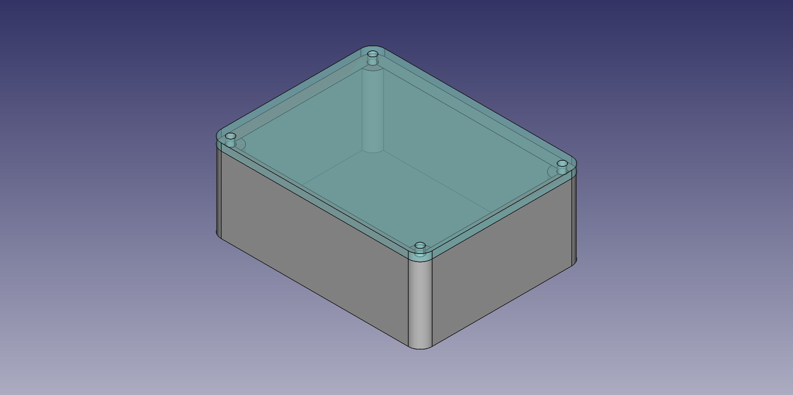

# That Box

The box that I always end up designing for every project.
Always.
Without fail.
The same box.

But this time I did the smart thing of making it a parametric template that can
be a base for all future projects that need to go in a moderately basic box.

Requires [FreeCad](https://www.freecad.org/) with the [Assembly4 workbench](https://github.com/Zolko-123/FreeCAD_Assembly4).

Parameters are defined in `Variables` in the assembly.
All are in mm and hopefully pretty self explanatory.
